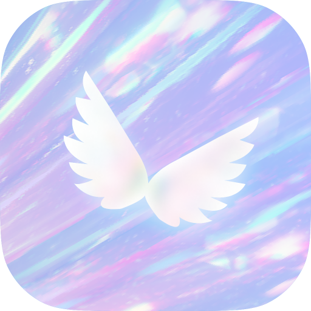

<p align="right">
  <a href="#english">English</a>
</p>

<br /><br />

<p align="center">
  
</p>

<h1 align="center">Reverie</h1>
<h3 align="center">大屏横屏游戏空间启动器</h3>

<p align="center">
  <strong>Landscape Game-Space Launcher for Android TV / Tablet / Handheld</strong>
</p>

<p align="center">
  <em>手柄全键位驱动 · 应用枚举与分类 · 最近游玩 · 使用统计 · 强制横屏 · Material You 动态主题</em>
</p>

<p align="center">
  <sub>v1.0.0 (2) · 2026-07-14 · Android 16 (API 36) · arm64-v8a · Kotlin + Jetpack Compose</sub>
</p>

<p align="center">
  <sub>© MocaBolka 2026 · co-created with CodeBuddy</sub>
</p>

---

<br />

<p align="center">
  <strong>Reverie 能做什么？</strong><br /><br />
  ▸ <strong>横屏游戏空间</strong>：左详情面板 + 右应用列表的大屏主屏，状态栏与收藏坞一应俱全<br />
  ▸ <strong>全手柄操作</strong>：左摇杆/方向键导航，A 启动、B 返回、X 收藏、Y 搜索、LB/RB 切分类、LT/RT 翻页<br />
  ▸ <strong>应用管理</strong>：枚举已装应用、自动分类、收藏置顶、关键词搜索<br />
  ▸ <strong>最近游玩 & 使用统计</strong>：基于系统用量记录的"最近玩过"，以及日/周/月/年使用时长报表，原生 Material 日期选择器<br />
  ▸ <strong>视觉与主题</strong>：动态氛围背景、玻璃拟态、Material You 莫奈取色 + BrandColors 紫罗兰默认色板、深色/AMOLED 纯黑模式<br />
  ▸ <strong>系统兼容</strong>：强制横屏锁、挖孔屏适配、瀑布屏安全边距、高刷新率、ColorOS 国产 ROM 兼容向导、通知角标<br />
  ▸ <strong>专注手柄的 UX</strong>：焦点框仅手柄连接时显、右摇杆物理积分滚动引擎、MD3 统一按钮库、全局表面令牌（SurfaceTokens）、列表/详情双态导航<br />
  ▸ <strong>零外部依赖</strong>：纯 Jetpack Compose 实现，设置本地持久化，无需联网即可运行
</p>

<br />

---

## 📋 导航

- [30 秒了解](#30-秒了解)
- [核心能力](#核心能力)
- [手柄按键速查](#手柄按键速查)
- [技术栈](#技术栈)
- [环境要求](#环境要求)
- [项目结构](#项目结构)
- [构建](#构建)
- [权限说明](#权限说明)
- [常见问题 FAQ](#常见问题-faq)
- [版本历史](#版本历史)

---

## 30 秒了解

**Reverie**（原名 MRunner）是一个面向电视、平板与掌机的**横屏 Android 启动器**。它把设备上已安装的游戏和娱乐应用整理成一个干净的大屏界面，并且从导航、启动、搜索到设置，**全程用手柄即可完成，无需触摸**。

它不是系统默认桌面，而是作为一个普通应用独立运行——图标启动即进入游戏空间。首页采用**列表态 / 详情态双态导航**：左摇杆上下浏览应用列表，A 键进入详情面板，再按 A 启动，B 退回列表。任何旋屏设备均可通过内置**强制横屏锁**锁定横屏。

---

## 核心能力

### 横屏游戏空间主屏

专为大屏宽屏设计的主界面：

- **宽屏左右分栏**（≥720dp）：左侧 300dp 详情面板（`AppDetailPanel`），右侧横排详细列表（`AppListItem`）
- **中等屏自适应**（<720dp）：主列表 + 底部 HUD 浮层（`AnimatedVisibility` + `slideInVertically`）
- **详情面板**：图标 / 名称 / 版本 / 启动时间 / 收藏 / 应用信息，日/周使用时长；支持焦点滚动（`FocusScroll.kt` 驱动，焦点出窗口自动滚入视野）
- **应用列表每行**：图标 + 名称 + 副标题 + 上次游玩 + 收藏按钮 + 通知角标
- **顶部 StatusBar**：时段问候语 + 四选一滑块 Tab（主页 / 统计 / 搜索 / 设置）+ 设置齿轮
- **底部收藏坞（Dock）**：常驻常用应用，一键启动
- **瀑布屏/曲面屏安全边距**：`Waterfall.kt` 自动读取 `displayCutout` 左右 inset 并取最大安全值，横屏时短路零开销

### 全手柄导航

自研手柄抽象层（`GamepadManager` → `GamepadEvent` + `XboxMapping`），物理按键归一为领域事件，UI 只消费事件。支持：

- 左摇杆 / 十字键帽导航，死区 0.40、回中 0.28、两段式长按加速（180ms→80ms）
- 右摇杆物理积分引擎（`RightStickScrollEngine.kt`）：真实帧间隔 `dt` 驱动、二段式 grow 加速（越滚越快，封顶 20000），60/120/144Hz 表现一致
- **列表态/详情态双态导航**：列表态 A 进详情、X 直接启动、Y 收藏、B 返回；详情态 A 触发当前按钮（默认启动）、B 退回列表；详情左右键在按钮间切焦点，上下 clamp 夹边界
- 所有 Dialog（下拉 / 信息 / 确认 / 日期选择）由桥接器统一分发键位事件
- 底部 HUD（竖屏）同步 `focusedButtonIndex`，焦点框 + A 浮块跟随
- 搜索页默认进入输入态，A/B 在输入 / 列表间切换
- 统计页左右分栏独立：左排行（LB/RB 翻篇）、右总览（右摇杆滚动）

### 焦点框智能显示

`FocusIndicators.kt` 通过 `LocalShowFocusIndicators` 全局开关控制焦点框渲染，手柄连接时显示导航焦点框，纯触控/手柄未连接时自动隐藏。全场景（AppListItem / AppDetailPanel / SubPage / StatsScreen / LaunchCircleButton / Buttons）统一由 `Modifier.focusBorder()` 守卫，无死区。

### 应用枚举与分类

通过 `PackageManager.queryIntentActivities(MATCH_ALL)` 枚举已装应用（无须默认桌面身份），可选包含系统应用。按类别分组（游戏 / 影视 / 音乐 / 社交 / 工具等 9 类），支持**逐应用分类覆盖**。图标经磁盘缓存（`IconCache`，`filesDir/icons/{pkg}.png`），二次启动 5s→~1-2s。`LauncherApps.Callback` 增量监听包变化。

### 收藏与最近游玩

- **收藏坞（Dock）**：底部常驻，一键启动，支持清空收藏（二次确认）
- **最近游玩**：基于 `UsageStatsManager` 近似还原"最近玩过"（需用量访问权限），并行懒加载

### 搜索

手柄驱动的关键词搜索，实时高亮匹配，相关性排序（前缀 > 标签 > 包名 > 分类）。支持结果计数标签、Enter 直接启动首项。搜索态下放行光标供输入；软键盘隐藏后 B/Y 合并为退出输入。

### 使用统计

完整统计页（`StatsScreen`）：

- 日 / 周 / 月 / 年四档报表，`ReverieSegmentedRow` 分段控件切换
- **原生 Material3 DatePicker / DateRangePicker**（日/月/年视图），周视图由选日按周首落周
- 24 小时分布条形图、趋势图
- 增量写入 `usage_stats.json`（原子写，查询 O(1)）

### 全局表面令牌（SurfaceTokens）

`SurfaceTokens.kt` 终结散落 alpha 魔法值：统一焦点背景（0.20）、按压背景、卡片表面层级、scrim 遮罩（引用 `MotionSpec.ScrimAlpha`）、静音文字、玻璃底色、分段容器色等。配套 `SurfaceCard` / `ReverieToast` / `AccentIconSquare` 等可复用组件。改一处全站生效。

### MD3 统一按钮库（Buttons.kt）

5 类 MD3 标准按钮 + 自绘 `ReverieSegmentedRow<T>` 分段控件：

| 按钮 | 说明 |
|------|------|
| `ReverieFilledButton` | 实心主按钮 |
| `ReverieTonalButton` | 色调按钮 |
| `ReverieOutlinedButton` | 描边按钮 |
| `ReverieTextButton` | 文字按钮 |
| `ReverieIconButton` | 图标按钮 |
| `ReverieSegmentedRow<T>` | 分段切换控件（官方 `SegmentedButton` 在 material3 1.3.2 不可用，自绘等价实现） |

所有按钮设 `danger=true` 时使用 error 色，统一 40dp 高、`shapes.medium` 圆角、`wrapFocusBorder` 焦点边框。

### 视觉与主题

| 能力 | 说明 |
|------|------|
| BrandColors 默认色板 | 紫罗兰深蓝**自定义色板**（非 MD3 默认蓝），补全 M3 全部色键 |
| Material You 莫奈 | 从系统壁纸提取色板，深色模式将基础色与强调色分开处理——强调色保留莫奈，背景退回项目自带深色 |
| AMOLED 纯黑 | 背景 `Color.Black`，强调色保留莫奈，开关无重启 |
| 动态氛围背景 | 缓慢漂移的柔光渐变（可关，省电/晕动友好） |
| 玻璃拟态 | 详情面板/状态栏磨砂模糊、光晕描边（可关） |
| 壁纸穿透 | 可选显示系统桌面壁纸作背景 |
| 减少动效 | 冻结无限循环动画，`Motion.kt` 全链路守卫 |

### 系统兼容与优化

- **强制横屏锁**：`systemExempted` 前台服务（`OrientationLockService`）挂载透明 `TYPE_APPLICATION_OVERLAY` 约束系统方向，8 种方向模式可选
- **挖孔屏适配**：横屏内容延伸至摄像头区域（`windowInsetsPadding(displayCutout)`），OPPO/华为 ROM 短边特殊处理
- **瀑布屏安全边距**：`Modifier.waterfallSafePadding()` 自动适配曲面屏，横屏短路零开销
- **高刷新率**：resume 拉满峰值帧率，idle/pause 回落平衡率省电
- **触感反馈**：手柄振动反馈焦点与确认
- **ColorOS 兼容向导**：首次启动 5 项 OEM 权限引导（电池优化 / 自启动 / 悬浮窗 / 用量访问 / 通知监听），深链跳转 + 安全兜底
- **通知角标**：可选 `NotificationListenerService`（默认关，需系统设置开启）

### 子页面与开屏

- **Splash 沉浸化**：自适应 Adaptive Icon（`ic_launcher.xml`，三层前景/背景/单色）+ `brandtext.png` 品牌图 + `Theme.SplashScreen` 亮暗双主题 + 无标题栏/全屏。原生 Splash 仅对齐深色背景，第二幕 `SplashOverlay` 由 `HomeScreen` 数据就绪后驱动
- **SubPageScaffold**：统一全屏子页面框架（`AnimatedVisibility` 左右进出动画）、底部固定按钮（`bottomAction`）、右摇杆焦点跟随（`suppressAutoScroll` 防反向抖动）、`showFocusIndicators`、瀑布屏安全边距
- **About / Licenses 页**：子页面独立 `MaterialTheme`（深色/莫奈跟随）、双路 `AnimatedVisibility` 实现 About↔Licenses 连贯转场、完整手柄导航、开源许可入口

---

## 手柄按键速查

| 按键 | 作用 |
|------|------|
| 左摇杆 / 方向键 | 导航列表与面板 |
| **A** | 列表态→进详情 / 详情态→触发按钮 / 输入态→启动首项 |
| **B** | 返回 / 退出 / 输入态→退输入 |
| **X** | 列表态→直接启动聚焦应用 |
| **Y** | 列表态→搜索 / 搜索态→收藏切换 |
| **LB / RB** | 切换分类 Tab / 统计页翻月翻年 |
| **LT / RT** | 切换主页面（主页 / 统计 / 搜索 / 设置） |
| 右摇杆 | 物理积分滚动（越滚越快） |
| 左摇杆按压 | 详情态退回列表 / 统计页弹出日期选择 |
| **Menu** | 打开设置 |

---

## 技术栈

| 层 | 技术 | 角色 |
|----|------|------|
| 语言 | Kotlin 2.x（JVM 17） | 应用逻辑 |
| UI | Jetpack Compose（BOM 2025.06.00，Material 3 1.3.2） | 声明式界面、主题、动画 |
| 架构 | MVVM（ViewModel + StateFlow） | UI 状态与业务逻辑 |
| 输入 | 自研手柄层（GamepadEvent / GamepadManager / XboxMapping / GamepadDetector / RightStickScrollEngine） | 全控制器抽象为领域事件 |
| 应用数据 | `PackageManager`（`queryIntentActivities`）+ `LauncherApps.Callback` | 枚举应用、增量监听 |
| 最近/统计 | `UsageStatsManager` | 最近应用与使用时长 |
| 持久化 | `SharedPreferences` + JSON 文件 | 设置项与用量统计 |
| 兼容 | NotificationListenerService、前台服务 | 角标、强制横屏锁 |
| 构建 | Android Gradle Plugin 8.x + Kotlin Gradle Plugin | 构建与 R8 压缩（release） |
| 图标 | Adaptive Icon（`ic_launcher.xml`）+ VectorDrawable（`ic_app_logo`） | 原生 Splash、应用内图标 |

---

## 环境要求

- **Android 16（API 36）** 设备——手机、平板、电视或掌机，横屏使用
- Android SDK **`android-36.1`**（需 FRAME_RATE_CATEGORY / RampSegment 等 API 36 符号）
- Gradle（已内置 wrapper），首次构建需联网拉取依赖
- `QUERY_ALL_PACKAGES` 已声明；非默认桌面场景建议在系统设置授予"应用列表访问"
- 最近游玩与使用统计需 `PACKAGE_USAGE_STATS` 权限（设置 → 特殊权限 → 用量访问）
- 竖屏设备强制横屏需授予**显示在其他应用上层（悬浮窗）**权限

---

## 项目结构

```
Reverie/
├── app/
│   ├── build.gradle.kts        # namespace cn.mocabolka.run, minSdk/targetSdk 36, versionCode 2
│   ├── proguard-rules.pro      # Release 的 R8 规则
│   └── src/main/
│       ├── AndroidManifest.xml # 权限、Activity、Service（OrientationLock、NotificationBadge）
│       ├── java/com/example/landscape/
│       │   ├── LauncherApplication.kt   # Application 子类，全局崩溃兜底
│       │   ├── MainActivity.kt          # Compose 宿主、输入分发、生命周期、刷新率、Splash 安装
│       │   ├── gamepad/                 # 手柄抽象层
│       │   │   ├── GamepadEvent.kt      # 领域事件与枚举模型
│       │   │   ├── GamepadManager.kt    # 按键/摇杆 → 事件，死区、重复、滚动
│       │   │   ├── GamepadDetector.kt   # 连接检测（InputDevice 广播）
│       │   │   ├── RightStickScrollEngine.kt # 右摇杆物理积分滚动引擎
│       │   │   └── XboxMapping.kt       # 按键 → 事件映射（Xbox/标准 HID）
│       │   ├── launcher/                # 数据与领域层
│       │   │   ├── AppModel.kt          # 应用数据模型与分类映射
│       │   │   ├── AppRepository.kt     # 枚举应用、IconCache
│       │   │   ├── RecentsRepository.kt # 最近应用（UsageStats）
│       │   │   ├── UsageStatsRepository.kt # 用量聚合与持久化（usage_stats.json）
│       │   │   ├── FavoritesRepository.kt   # 收藏
│       │   │   ├── CategoryMapping.kt / CategoryOverrideRepository.kt
│       │   │   └── AppLauncher.kt / AppCache.kt / IconCache.kt / GameWhitelist.kt
│       │   ├── compat/                  # 厂商与系统兼容
│       │   │   ├── ColorOSCompat.kt     # 深链跳转 ColorOS 设置
│       │   │   ├── CompatGuideActivity.kt # 首次启动兼容向导 + SubPageScaffold
│       │   │   ├── OrientationLockService.kt / OrientationManager.kt # 强制横屏锁
│       │   │   ├── NotificationBadgeService.kt # 通知监听（角标）
│       │   │   └── *PermissionHelper.kt # 电池 / 悬浮窗 / 用量访问 助手
│       │   ├── viewmodel/
│       │   │   └── HomeViewModel.kt     # 核心 ViewModel（事件、状态、加载、统计）
│       │   ├── ui/
│       │   │   ├── HomeScreen.kt        # 主屏组合、焦点分发、右摇杆引擎、列表/详情双态
│       │   │   ├── SettingsRepository.kt# 全部设置（StateFlow + SharedPreferences）
│       │   │   ├── OrientationMode.kt   # 方向模式枚举
│       │   │   ├── DisplayRefresh.kt    # 刷新率管理
│       │   │   ├── Haptics.kt           # 触感反馈
│       │   │   ├── theme/
│       │   │   │   ├── Theme.kt         # 主题入口 + BrandColors 紫罗兰色板
│       │   │   │   ├── MonetTheme.kt    # Material You 莫奈取色
│       │   │   │   ├── Motion.kt        # 统一动画引擎：MotionSpec、rememberPulse、PulseSpec
│       │   │   │   ├── Dimens.kt        # 全局间距体系
│       │   │   │   ├── FocusIndicators.kt # 焦点框全局开关 + focusBorder modifier
│       │   │   │   ├── SurfaceTokens.kt # 表面令牌层：alpha、卡片、遮罩、玻璃
│       │   │   │   ├── Buttons.kt       # MD3 统一按钮库（5 类 + SegmentedRow）
│       │   │   │   └── Waterfall.kt     # 瀑布屏安全边距处理器
│       │   │   └── components/
│       │   │       ├── AppDetailPanel.kt # 详情面板（启动/收藏/信息，FocusScroll 接入）
│       │   │       ├── AppListItem.kt    # 应用列表行 + 焦点环 + 搜索高亮
│       │   │       ├── AppTile.kt        # 应用磁贴（备用）
│       │   │       ├── Dock.kt           # 底部收藏坞
│       │   │       ├── StatusBar.kt      # 状态栏（问候语 + 四 Tab + 设置齿轮）
│       │   │       ├── RecentsRow.kt     # 最近游玩行
│       │   │       ├── SettingsPage.kt   # 设置页（SettingItem 模型、Drop/Info/Confirm Dialog）
│       │   │       ├── StatsScreen.kt    # 统计页（原生 DatePicker、SegmentedRow、柱状图）
│       │   │       ├── SplashAnimation.kt# 开屏动画（三圆点呼吸）
│       │   │       ├── AmbientBackground.kt # 动态氛围背景
│       │   │       ├── RevealOverlay.kt  # 揭示遮罩
│       │   │       ├── FocusScroll.kt    # 焦点滚动容器（非 Lazy 列表）
│       │   │       └── AboutPage.kt / LicensesPage.kt # 关于 / 开源许可
│       └── res/
│           ├── drawable/                 # ic_app_logo.webp, ic_splash_logo.xml, brandtext.png
│           ├── mipmap-anydpi-v26/        # ic_launcher.xml (Adaptive Icon, 3-layer)
│           ├── mipmap-*/                 # launcher icon raster fallback
│           ├── values/themes.xml         # Theme.Launcher.Starting / Launcher / Landscape
│           └── values/strings.xml        # 应用名称、兼容向导、横屏锁文案
├── gradle/                       # Wrapper
├── build.gradle.kts              # 根构建配置
├── settings.gradle.kts
├── gradle.properties
├── gradlew / gradlew.bat
└── icon.png                      # 应用图标
```

---

## 构建

```powershell
# Debug（依赖已缓存时可离线）
.\gradlew.bat assembleDebug

# Release（R8 压缩 + 资源缩减）
.\gradlew.bat assembleRelease
```

产物 APK：`app/build/outputs/apk/debug/app-debug.apk`（或 `release/`）。

> **注意**：`minSdk` / `targetSdk` 固定为 API 36（Android 16）。项目依赖 `android-36.1` 帧率分类符号与 `core-splashscreen:1.0.1`，假设设备为 64 位 ARM（`arm64-v8a`），不产出 x86 / 32 位构建。Release 通过 R8 + ProGuard 缩减，APK 约 30-41MB。

---

## 权限说明

| 权限 | 用途 |
|------|------|
| `QUERY_ALL_PACKAGES` | 枚举已装应用，构建游戏空间列表 |
| `PACKAGE_USAGE_STATS` | 最近游玩与使用统计 |
| `REQUEST_IGNORE_BATTERY_OPTIMIZATIONS` | 后台保活 |
| `VIBRATE` | 手柄触感反馈 |
| `FOREGROUND_SERVICE` / `FOREGROUND_SERVICE_SYSTEM_EXEMPTED` | 强制横屏锁服务 |
| `SYSTEM_ALERT_WINDOW` | 竖屏设备横屏锁悬浮窗 |
| `BIND_NOTIFICATION_LISTENER_SERVICE` | 通知角标（可选） |

---

## 常见问题 FAQ

### Q：Reverie 是默认桌面吗？
A：不是。它作为普通应用独立运行，打开即进入游戏空间，可随时切回系统桌面。

### Q：没有手柄能用吗？
A：可以。界面同时支持触摸与鼠标交互；手柄只是提供了"全程免触摸"的完整体验。无手柄连接时焦点框自动隐藏，界面更干净。

### Q：为什么列表里应用很少？
A：若未授予"应用列表访问"（`QUERY_ALL_PACKAGES` 受限），枚举可能为空。UI 会显示可聚焦的「前往授权」入口，授予后重新扫描即可。

### Q：最近游玩不准？
A：数据为基于系统用量统计的近似结果，需授予 `PACKAGE_USAGE_STATS` 权限；部分厂商 ROM 用量记录本身不完整。

### Q：强制横屏在竖屏手机上不生效？
A：需在系统设置授予「显示在其他应用上层（悬浮窗）」权限，否则服务会提示并跳转到权限页。

### Q：Material You 取色看着怪？
A：莫奈深色 `background/surface` 是壁纸调深色版（浅紫/浅蓝等），不符合规范。Reverie 已将基础色退回紫罗兰深蓝而强调色保留莫奈——若仍不满意，可在设置页关闭莫奈取色回退 BrandColors。

### Q：下拉 Dialog 按方向键没反应？
A：所有 Dialog 由 `SettingsControlBridge` / `StatsDatePickerBridge` 桥接器统一分发键位事件，确认当前焦点在 Dialog 内。若仍有问题，检查手柄是否连接（焦点框可见即已连接）。

### Q：开源吗？
A：当前以专有（Proprietary）协议发布，仅供学习与个人使用。

---

## 版本历史

当前版本：**v1.0.0 (2) — 2026-07-14**。

完整变更记录参见 `changelog.md`。主要更新摘要：

- **Splash 收口**：Adaptive Icon + brandtext 品牌图 + Theme.SplashScreen 亮暗双主题，移除冗余 Splash API
- **BrandColors**：紫罗兰 M3 色板作为默认配色，莫奈取色时代替内置黑底
- **手柄大重构**：移除跨栏逻辑，列表态/详情态双态导航；修复 AXY 无响应致命 bug；右摇杆物理积分引擎独立；焦点框仅手柄连接时可见，热插拔响应
- **新基础设施**：`FocusScroll.kt`、`FocusIndicators.kt`、`RightStickScrollEngine.kt`、`Buttons.kt`、`SurfaceTokens.kt`、`Waterfall.kt` 六个新文件
- **统计页**：恢复周视图，原生 Material3 DatePicker/DateRangePicker，桥接器分发键位事件
- **子页面**：SubPageScaffold 底部固定按钮 + 右摇杆焦点跟随 + 动画修复 + 主题跟随
- **全局修复**：DetailHud 移除、ConfirmDialog 居中、全屏 Toast 修复、81+ IDE Problems 清零、API 36 全量合规确认

---

## English

**Reverie** is a landscape-oriented Android launcher for TVs/tablets/handhelds. It organizes games and entertainment apps into a clean big-screen layout with full gamepad control.

**Latest build: v1.0.0 (2) — 2026-07-14**

Key capabilities include: dual-state (list/detail) landscape home with adaptive 21:9 layout, complete gamepad abstraction with physical right-stick scroll engine, app enumeration without default-launcher identity, UsageStats-based recents & statistics with native Material3 DatePicker, Material You (Monet) dynamic theming with BrandColors violet fallback, forced-landscape lock service via systemExempted foreground service, ambient background & glassmorphism, intelligent focus-indicator visibility (hidden without gamepad), FocusScroll for non-Lazy containers, MD3 button library (5 types + segmented control), SurfaceTokens global token layer, waterfall/curved-screen safe padding, ColorOS compatibility wizard, notification badges, adaptive-icon + brand-image splash, and 100+ IDE problems elimination.

Tech: Kotlin + Jetpack Compose (BOM 2025.06.00, Material3 1.3.2), MVVM, `minSdk`/`targetSdk` = API 36, `arm64-v8a`. Build with `.\gradlew.bat assembleDebug`.

---

<p align="center">
  <sub>专有协议 · 保留所有权利 · 本文档及代码包含 AI 辅助生成，仅供参考</sub>
</p>
